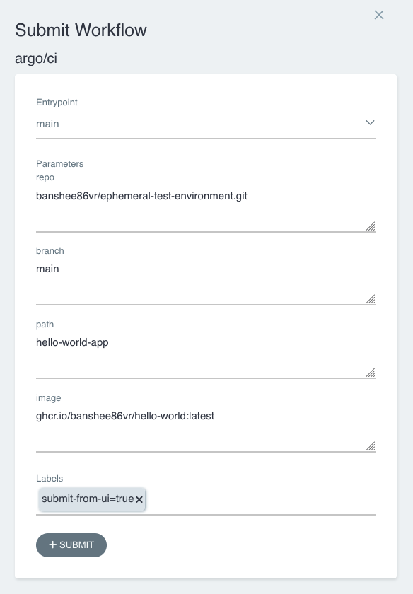
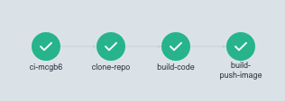
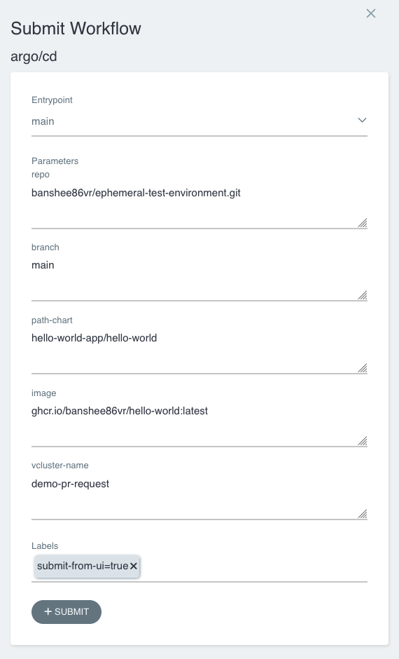
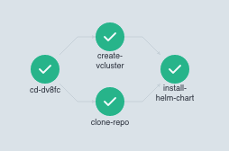

# Configuration of Argo Workflow entities

## Prerequisites:
- Minikube
- `kubectl` command-line tool installed and configured to connect to your Kubernetes cluster.
- Helm version 3.x installed.

## Preparation steps:

### 1. Start minikube and install Argo Workflows using Helm:

```bash
minikube start
helm repo add argo https://argoproj.github.io/argo-helm
helm install argo-workflows argo/argo-workflows
```

This command installs Argo Workflows in the default namespace of your Kubernetes cluster.

### 2. Verify the Installation:

To check if the installation was successful, you can run:

```bash
kubectl get pods -n argo
```

You should see a list of pods running with names prefixed with `workflow-controller` and `argo-server`.

### 3. Patch argo-server authentication¶

As reported on the official documentation: https://argo-workflows.readthedocs.io/en/latest/quick-start/#patch-argo-server-authentication

The argo-server (and thus the UI) defaults to client authentication, which requires clients to provide their Kubernetes bearer token to authenticate. For more information, refer to the Argo Server Auth Mode documentation. We will switch the authentication mode to server so that we can bypass the UI login for now:

```bash
kubectl patch deployment \
  argo-server \
  --namespace argo \
  --type='json' \
  -p='[{"op": "replace", "path": "/spec/template/spec/containers/0/args", "value": [
  "server",
  "--auth-mode=server"
]}]'
```

### 4. Access Argo Workflows UI (Optional):

Argo Workflows provides a web-based UI for managing and monitoring workflows. To access the UI, you need to expose it as a service:

```bash
kubectl port-forward svc/argo-server -n argo 2746:2746
```

Now you can access the Argo Workflows UI by navigating to `http://localhost:2746` in your web browser.

### 5. Add privileges to Argo service accounts

> Add this privileges to the Argo service accounts are recommended only for demo purposes. **IT'S STRONGLY NOT RECOMMENDED TO REPLICATE THIS CONFIGURATION IN PRODUCTION EVINRONMENTS.**

This command adds `cluster-admin` clusterrole to `argo:argo-server` and `argo:default`. In this way Argo Workflow can managed every kind of resources in every namespaces of the cluster.

```bash
kubectl create clusterrolebinding argo-admin-server --clusterrole=cluster-admin --serviceaccount=argo:argo-server -n argo
kubectl create clusterrolebinding argo-admin-default --clusterrole=cluster-admin --serviceaccount=argo:default -n argo
```
> In production evironments it's strongly recommended to create a dedicated role to these service accounts allowing only required verbs on the resources managed by the workflows.

### 6. Prepare secrets required by the pipelines

Just in case of private Git repository you can run this command to allow the clone command executed by the pipeline `ci.yaml`:

```bash
kubectl create secret generic github-token -n argo --from-literal=token=.........
```

This command create the secret that contains the credentials to push the Docker image to the registry:

```bash
export DOCKER_USERNAME=******
export DOCKER_TOKEN=******
kubectl create secret generic docker-config --from-literal="config.json={\"auths\": {\"https://ghcr.io/\": {\"auth\": \"$(echo -n $DOCKER_USERNAME:$DOCKER_TOKEN|base64)\"}}}"
```

### 7. Add Argo WorkflowTemplate manifests

```bash
git clone https://github.com/banshee86vr/ephemeral-test-environment.git
cd argo/workflow

kubectl apply -f ci.yaml
kubectl apply -f lang/go.yaml
kubectl apply -f cd.yaml
```
## Execution steps:

With all prerequisites met and Argo Workflows successfully deployed and configured, you dive into the execution steps to start creating and managing workflows.

### 8. Submit the CI pipeline

To submit the CI pipeline, you can use the [official APIs](https://argo-workflows.readthedocs.io/en/latest/rest-api/):

```bash
<ArgoWorkflow URL>/api/v1/workflows/{namespace}/submit
```

Or, alternatively, you can submit the workflow using the UI:



The CI pipeline performs these steps:

1. **Cloning Repository**: Fetches the source code from the git repository.
2. **Building Application**: Utilizes the GoLang template to compile the Go application.
3. **Building and Pushing Docker Image**: Packages the application into a Docker image and pushes it to the registry.

After the completion of all steps you can check the correct status of every step:



If all steps have been successfully completed, you can find a new version of the Docker image in your registry.

### 9. Submit the CD pipeline

To submit the CD pipeline, you can use the [official APIs](https://argo-workflows.readthedocs.io/en/latest/rest-api/):

```bash
<ArgoWorkflow URL>/api/v1/workflows/{namespace}/submit
```

Or, alternatively, you can submit the workflow using the UI:



The CD pipeline performs these steps:

1. **Preparing an ephemeral environment**: Prepares an ephemeral environment using vCluster where the user can test the application inside an isolated Kubernetes cluster
2. **Deploy the application**: Deploy the application Helm chart on the vCluster just created

After the completion of all steps you can check the correct status of every step:



If all steps have been successfully completed, you can check the status of your application deployed on the vCluster just created

### 10. Access to the application

To check how to access to the application deployed on vCluster, you can run this commands to list all vCluster and to access it:

```bash
$ vcluster list
  
         NAME       | CLUSTER  |    NAMESPACE    | STATUS  | VERSION | CONNECTED |            CREATED            |   AGE   | DISTRO  
  ------------------+----------+-----------------+---------+---------+-----------+-------------------------------+---------+---------
    demo-pr-request | minikube | demo-pr-request | Running | 0.19.0  |           | xxxx-xx-xx xx:xx:xx +0100 CET | 1h8m49s | OSS

$ ➜ vcluster connect demo-pr-request --namespace demo-pr-request -- kubectl get pod -n demo-pr-request

NAME                                           READY   STATUS    RESTARTS   AGE
demo-pr-request-hello-world-7f6d78645f-bjmjc   1/1     Running   0          7s
```

As reported [here](https://www.vcluster.com/docs/using-vclusters/access) you can expose in different way the ephemeral vCluster created.

- **Via Ingress**: An Ingress Controller with SSL passthrough support will provide the best user experience, but there is a workaround if this feature is not natively supported.

  - Kubernetes Nginx
  - Traefik Proxy
  - Emissary

  Make sure your ingress controller is installed and healthy on the cluster that will host your virtual clusters. More details [here](https://www.vcluster.com/docs/using-vclusters/access#via-ingress)
- **Via LoadBalancer service**: The easiest way is to use the flag `--expose` in vcluster create to tell vCluster to use a LoadBalancer service. It depens on the specific implementation of host kubernetes cluster.
- **Via NodePort service**: You can also expose the vCluster via a NodePort service. In this case you have to create a NodePort service and change the `values.yaml` file to use for creation of the vCluster. More details [here](https://www.vcluster.com/docs/using-vclusters/access#via-nodeport-service)
- **From Host Cluster**: In order to access the virtual cluster from within the host cluster, you can directly connect to the vCluster service. Make sure you can access that service and then create a kube config in the following form:
  
  ```bash
  vcluster connect my-vcluster -n my-vcluster --server=my-vcluster.my-vcluster --insecure --update-current=false
  ```
